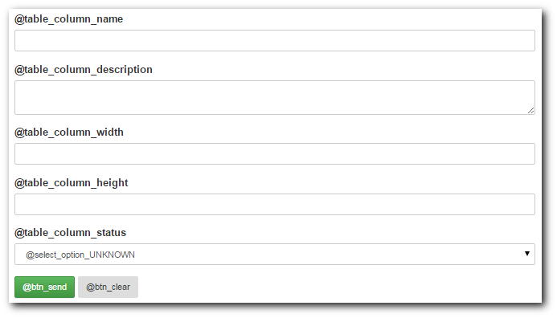
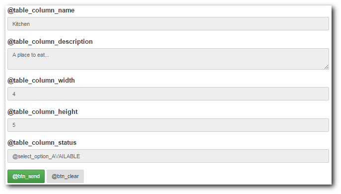
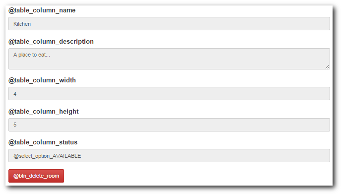

# TooBasic: Forms Builder
## What is Forms Builder?
_Forms Builder_ is an internal mechanism of __TooBasic__ that allows to specify
HTML forms a JSON configuration.
The main idea in it is to create single specification for certain form and be able
to show it in more than one mode.

For example, if create a form to display an item in the database, other to edit
it, other when you have to remove it and another to create a new item, the first
thing you'll notice is that it is the same form where the only change is it's
behavior and maybe how many buttons it has at the end.
For those cases, _Forms Builder_ provides a way to specify fields once and some
specific properties depending on how the form should be built.

## Example
Before we start using _Form Builder_, let's think an example to work with.
Let's suppose you created a table in your system called `rooms` and it's
representation artifacts (_item-reprensentation_ and _items-factory_) representing
some part of some house.
Also you created these controllers (along with it's and views):

* `rooms`: To list all rooms.
* `room`: To show a room.
* `room_create`: To create a new room.
* `room_edit`: To modify a room.
* `room_delete`: To destroy a room.

Now let's say that you table `rooms` has these fields:

* `id`
* `name`
* `description`: a long text.
* `width`
* `height`
* `status`: Possible values are:
	* `AVAILABLE`
	* `OCCUPIED`
	* `REPAIR`
	* `UNKNOWN`

Now, _what would be the problem here?_
Let's say you want to use a single form definition for all your room controllers
(except controller `rooms`) and then invoke it inside your view.
The next sections will guide you in how to do such a thing.

### Warning
This example will be built step by step so you can see how to create a complete
form with its details using commands.
But that can be a little tedious, so, if you simply want to create a basic form,
[this link](tech/qforms.md) may be of more use.

## Using forms
### Creating a form
the first thing to do is to create an initial definition for our form and for that
we're going to run this command:
```text
$ php shell.php sys forms create table_rooms
```
This command will generate a new _Forms Builder_ specification file at
`ROOTDIR/site/forms/table_rooms.json` with some basic structure (not yet useful).
We won't go into specifics regarding the actual configuration, for that you can
click [this link](tech/forms.md) and get more information about it.

### Form name
Something we suggest you to set is the form's name, this simple property will be
used as form ID when building a HTML version and also in it's inputs IDs.
If you want you can omit this step because the previous one already used the file
name to set this property, but if you want to change it you can run this command
(it won't change the file name):
```text
$ php shell.php sys forms --set-name my_form --form table_rooms
```
From now on, will assume you've run this command.

### Form action and method
By default all your form are going to be sent to `#` (same page) and they will use
`GET` as sending method, but you can change this using commands like this:
```text
$ php shell.php sys forms --set-action '?action=someaction' --form table_rooms
$ php shell.php sys forms --set-method 'post' --form table_rooms
```
This will get you something like this:
```html
<form id="my_form" action="?action=someaction" method="post">
```
But of course, this could be what you want, but only for some usage of your form,
not for everything.
For example, if you use this form to make a creation _dry-test_ and only then you
need these values, you can run something like this:
```text
$ php shell.php sys forms --set-action '?action=someaction' --form table_rooms --mode dry_test
$ php shell.php sys forms --set-method 'post' --form table_rooms --mode dry_test
```
With this, you'll be using default values unless you build your form for
`dry_test` mode.

Something to have in mind is that `dry_test` is not an standard (known by
__TooBasic__ mode) which means may not apply some useful behaviors, but you can
use it anyway.
Standard modes are:

* `create`
* `edit`
* `remove`
* `view`

### Form type
The form type indicates how your form is going to be build, basically what HTML
structure it's going to have. You can set it this way:
```text
$ php shell.php sys forms --set-type bootstrap --form table_rooms
```
Available types are:

* `basic`: Simple structure where each label is prompted (in the HTML code)
alongside it's form control without any encasing.
* `table`: Inside the form, a table is prompted with two columns, left for labels
and right for form controls.
* `bootstrap`: This type follows the encasing suggested by _Bootstrap_ ar [this
link](http://getbootstrap.com/css/#forms).

### Form attributes
Something else you can set on a form are attributes for the HTML tag `<form>`, for
example:
```text
$ php shell.php sys forms --set-attribute role --value form --form table_rooms
```
This will generate something like this:
```html
<form id="my_form" action="#" method="get" role="form">
```
And you can also run a command like this:
```text
$ php shell.php sys forms --set-attribute onsubmit --value "return confirm('Are you sure you want to remove this room?')" --form table_rooms --mode remove
```
This will show a confirmation alert when your form is submitted if it was build
for _remove_ mode.

Something you should know about setting attributes is that you can specify
attributes without values, for example this _Angular.js_ flag:
```text
$ php shell.php sys forms --set-attribute ng-non-bindable --true --form table_rooms
```
This will give you something like this:
```html
<form id="my_form" action="#" method="get" role="form" ng-non-bindable>
```

### Form fields
Now that we have our basic structure, we need to add fields and for that we're
going to run these commands:
```text
$ php shell.php sys forms --add-field id --type hidden --form table_rooms
$ php shell.php sys forms --add-field name --type input --form table_rooms
$ php shell.php sys forms --add-field description --type text --form table_rooms
$ php shell.php sys forms --add-field width --type input --form table_rooms
$ php shell.php sys forms --add-field height --type input --form table_rooms
$ php shell.php sys forms --add-field status --type enum:AVAILABLE:OCCUPIED:REPAIR:UNKNOWN --value UNKNOWN --form table_rooms
```
This with specify our six fields with their types, and in the case of `status`, it
will also tell which values are accepted and the default value for it.

But let's go a little further.
Because we're using a form of type `bootstrap`, we can add some nice classes to
our form controls, for example:
```text
$ php shell.php sys forms --set-field-attribute id --name class --value input-sm --form table_rooms
$ php shell.php sys forms --set-field-attribute name --name class --value input-sm --form table_rooms
$ php shell.php sys forms --set-field-attribute description --name class --value input-sm --form table_rooms
$ php shell.php sys forms --set-field-attribute width --name class --value input-sm --form table_rooms
$ php shell.php sys forms --set-field-attribute height --name class --value input-sm --form table_rooms
$ php shell.php sys forms --set-field-attribute status --name class --value input-sm --form table_rooms
```
Now our form controls will appear thinner :)

### Field labels
By default all field labels are build using field names and the prefix
`label_formcontrol_` unless you modify them by running commands like these:
```text
$ php shell.php sys forms --set-field-label name --value 'table_column_name' --form table_rooms
$ php shell.php sys forms --set-field-label description --value 'table_column_description' --form table_rooms
$ php shell.php sys forms --set-field-label width --value 'table_column_width' --form table_rooms
$ php shell.php sys forms --set-field-label height --value 'table_column_height' --form table_rooms
$ php shell.php sys forms --set-field-label status --value 'table_column_status' --form table_rooms
```
This commands sets the label we want for our fields except field `id`, we don't
care about its label because it's a hidden field.

__Warning__: You should have in mind that these labels won't show directly, they
will always be considered as translation keys and they'll be translated at
building time.

### Buttons
The last part you should specify for your form are buttons and here we're going to
make the next assumptions:

* All form buttons use the style `btn-sm` for not so big buttons.
* All form modes require a `submit` button and a `reset` except mode `remove`.
** `submit` buttons use the style `btn-success`.
* Form mode `remove` has only a `submit` button using the style `btn-danger`.

With all this things in mind, let's run these commands to create our buttons:
```text
$ php shell.php sys forms --add-button send --type submit --form table_rooms
$ php shell.php sys forms --add-button clear --type reset --form table_rooms
$ php shell.php sys forms --add-button delete --type submit --form table_rooms --mode remove
```
And now let's set some styles:
```text
$ php shell.php sys forms --set-button-attribute send --name class --value 'btn-sm btn-success' --form table_rooms
$ php shell.php sys forms --set-button-attribute clear --name class --value btn-sm --form table_rooms
$ php shell.php sys forms --set-button-attribute delete --name class --value 'btn-sm btn-danger' --form table_rooms --mode remove
```

### Button labels
By default, all buttons get a label using its name and the prefix `btn_`, but you
can change this using a command like this one:
```text
$ php shell.php sys forms --set-button-label delete --value 'btn_delete_room' --form table_rooms --mode remove
```

__Warning__: Again, you should have in mind that these labels won't show directly,
they will always be considered as translation keys and they'll be translated at
building time.

### Commands summary
By now you may be confused on what commands we've run and what command was just
used as an example, so let's show a full list of commands we considered to be run
in our example:
```text
$ php shell.php sys forms create table_rooms
$ php shell.php sys forms --set-name my_form --form table_rooms
$ php shell.php sys forms --set-action '?action=someaction' --form table_rooms --mode dry_test
$ php shell.php sys forms --set-method 'post' --form table_rooms --mode dry_test
$ php shell.php sys forms --set-type bootstrap --form table_rooms
$ php shell.php sys forms --set-attribute role --value form --form table_rooms
$ php shell.php sys forms --set-attribute onsubmit --value "return confirm('Are you sure you want to remove this room?')" --form table_rooms --mode remove
$ php shell.php sys forms --set-attribute ng-non-bindable --true --form table_rooms
$ php shell.php sys forms --add-field id --type hidden --form table_rooms
$ php shell.php sys forms --add-field name --type input --form table_rooms
$ php shell.php sys forms --add-field description --type text --form table_rooms
$ php shell.php sys forms --add-field width --type input --form table_rooms
$ php shell.php sys forms --add-field height --type input --form table_rooms
$ php shell.php sys forms --add-field status --type enum:AVAILABLE:OCCUPIED:REPAIR:UNKNOWN --value UNKNOWN --form table_rooms
$ php shell.php sys forms --set-field-attribute id --name class --value input-sm --form table_rooms
$ php shell.php sys forms --set-field-attribute name --name class --value input-sm --form table_rooms
$ php shell.php sys forms --set-field-attribute description --name class --value input-sm --form table_rooms
$ php shell.php sys forms --set-field-attribute width --name class --value input-sm --form table_rooms
$ php shell.php sys forms --set-field-attribute height --name class --value input-sm --form table_rooms
$ php shell.php sys forms --set-field-attribute status --name class --value input-sm --form table_rooms
$ php shell.php sys forms --set-field-label name --value 'table_column_name' --form table_rooms
$ php shell.php sys forms --set-field-label description --value 'table_column_description' --form table_rooms
$ php shell.php sys forms --set-field-label width --value 'table_column_width' --form table_rooms
$ php shell.php sys forms --set-field-label height --value 'table_column_height' --form table_rooms
$ php shell.php sys forms --set-field-label status --value 'table_column_status' --form table_rooms
$ php shell.php sys forms --add-button send --type submit --form table_rooms
$ php shell.php sys forms --add-button clear --type reset --form table_rooms
$ php shell.php sys forms --add-button delete --type submit --form table_rooms --mode remove
$ php shell.php sys forms --set-button-attribute send --name class --value 'btn-sm btn-success' --form table_rooms
$ php shell.php sys forms --set-button-attribute clear --name class --value btn-sm --form table_rooms
$ php shell.php sys forms --set-button-attribute delete --name class --value 'btn-sm btn-danger' --form table_rooms --mode remove
$ php shell.php sys forms --set-button-label delete --value 'btn_delete_room' --form table_rooms --mode remove
```
Quite a lot, but this is the base for a good example.

## Views
Now that you have your definition, you can use it in your views and we are going
to explain the difference for each one.
Now _modes_ will make more sense.

### _$ctrl->formFor()_
_Forms Builder_ provides you with a special function for you _Smarty_ templates
called `formFor` that allows you to render and insert a form based on one of your
configurations.
Such function requires three parameters and these are:

* __specification__: Name of your form specification.
* __item__: An associative array with values that can be used to fill your for.
* __mode__: Mode in which the form has to be built.

### Create view
Let's edit you view `room_create.html` and write something like this inside (using
_Smarty_):
```html
{$ctrl->formFor('table_rooms', false, 'create')}
```
This simple command will trigger the building of form `table_rooms` and generate
it for mode `create`, this will basically means that all form controls will be
shown with their default values.
Even if the second parameters is other than `false`, it will be ignored.

The result you'll get will look like this:

<center></center>

As we mention before, all labels are _translation keys_ which means you need to
define them.
Visit [this link](docs/language.md) for more information about it.

### Show view
Before we talk about how it looks like, let's make a modification in your
controller `room.php`. let's say we change it's default method into something like
this:
```php
protected function basicRun() {
	$room = $this->representation->rooms->item($this->params->get->id);
	$this->assign('room', $room ? $room->toArray() : false);

	return $this->status();
}
```
With that in mind, and supposing that you have all required representations
implemented, we're going to write something like this in your view `room.html`:
```html
{$ctrl->formFor('table_rooms', $room, 'view')}
```
And it may look like this:

<center></center>

Now, the two major differences you'll find is that this form has all field flagged
as read only and it's using the information from your item to fill each field with
some initial values.

### Edit view
Using this for view `room_edit.html`:
```html
{$ctrl->formFor('table_rooms', $room, 'edit')}
```
You'll get something like this:

<center></center>

This is similar to the previous example, but all field can be modified.

## Remove view
And using this for view `room_delete.html`:
```html
{$ctrl->formFor('table_rooms', $room, 'remove')}
```
You'll get something like this:

<center></center>

Here the differences are all fields in read-only mode and the red button we set
before with our commands.
Also, if you click the red button, it will present a confirmation modal and
then send data, also set by our commands.

## Removing

## Extras parameters
_Sys-tool_ `forms` also accept parameters like:

* `--module`: to indicate that all artifacts have to be generated inside certain module.

## Suggestions
If you want or need it, you may visit these documentation pages:

* [Quick Forms](tech/qforms.md)
* [Forms Specifications](tech/forms.md)
* [Languages](docs/language.md)
* [Representations](docs/representations.md)
