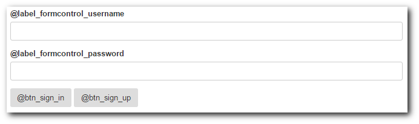
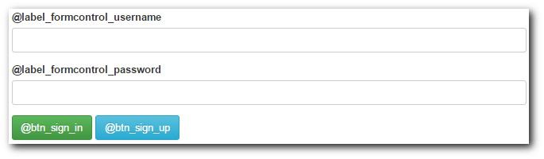

# TooBasic: Quick Forms (for Forms Builder)
## What is Quick Forms?
_Quick Forms_ is a _sys-tool_ named `qforms` that allows you to define a basic
_Forms Builder_ specification file with only one command.

If you just need a form with some fields and buttons, but no special behaviors for
each mode, this command will let you do that.
And, in case you need it, you can always use _sys-tool_ `forms` to make further
modifications.

## Example
Let's say you want to build a login form with this features:

* An input to place write the username.
* An input to right a password.
* A green button to send the information.
* A blue button to create a new user.
* This information should be sent to `?service=login` via `POST`.

## Creating a form
Based on our example, let's run this command:
```txt
$ php shell.php sys qforms create login -f username:input -f password:password -b sign_in:submit -b sign_up:button -a '?service=login' -m post -t bootstrap
```
Now put something like this in a view and you'll get something like the next
image:
```html
{$ctrl->formFor('login')}
```

<center></center>

__Note__: Remember that you'll need to define those translation keys in order to
get proper texts.

## Colored buttons
As we said before, you can use the _sys-tool_ `forms` to adjust those thing you
didn't get right by a quick creation, so, let's change our buttons colors:
```txt
$ php shell.php sys forms -f login -sba sign_in -n class -v 'btn-success'
$ php shell.php sys forms -f login -sba sign_up -n class -v 'btn-info'
```
That should change your form into something like this:

<center></center>

Now your buttons have the colors we wanted.

## Removing
You can also remove you specification running something like this:
```txt
$ php shell.php sys qforms remove login
```

## Twiks
If you are using forms with type `bootstrap`, you can add the parameters
`--bootstrap-extras` with this value to obtain some automatic tricks:

* `thin`: All inputs get the class `input-sm` and buttons get `btn-sm`.
* `bcolors`: All submit buttons get the class `btn-submit` and the rest get
`btn-default`.

## Suggestions
If you want or need it, you may visit these documentation pages:

* [Forms Builder](forms.md)
* [Forms Specifications](tech/forms.md)
* [Languages](language.md)
