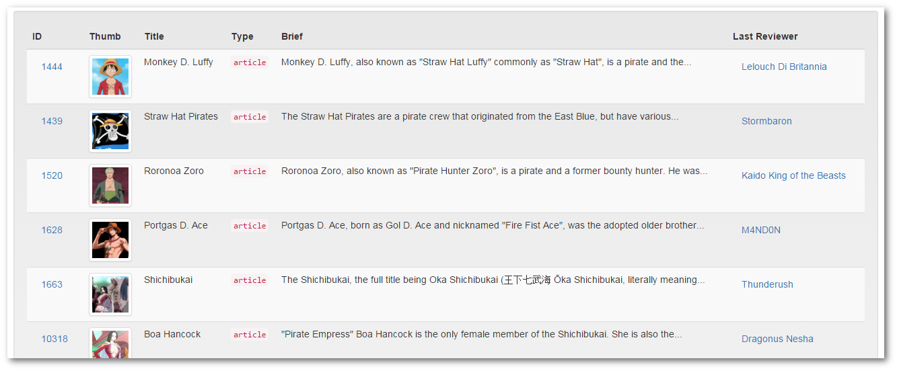

# TooBasic: Simple API Reports
## What is SApiReports?
_Simple API Reports_ is somehow an extension for _Simple API Reader_ and it allows
you to display some API information as a report, in other words, as a table inside
a view.

Let's revisit an example we gave [before](sapireader.md) and let's say you want to
have a page where every one can see a table with the most popular pages in _One
Piece Wikia_.
For that we're going to need two things, an _Simple API Reader_ configuration and
another for our report, and that's what we are going to talk about in the next
sections.

## API configuration
The first thing we need is to create a configuration to access most popular
articles in _One Piece Wikia_ and for that we're going to write the next
configuration at `ROOTDIR/site/sapis/onepiece.json`:
```json
{
	"name": "One Piece Wikia",
	"description": "One Piece Wikia Page (Non Official)",
	"url": "http://onepiece.wikia.com/api/v1",
	"type": "json",
	"services": {
		"popular": {
			"method": "GET",
			"uri": "/Articles/Popular?expand=1&limit=:limit&offset=:offset",
			"params": [":limit", ":offset"],
			"defaults": {
				":offset": 0,
				":limit": 50
			}
		}
	}
}
```

## Report configuration
The second thing is to write a configuration file for our report based on the API.
For that we're going to write the next configuration at
`ROOTDIR/site/sapis/reports/onepiece_popular.json`:
```json
{
	"api": "onepiece",
	"service": "popular",
	"listPath": "items",
	"params": [
		10
	],
	"columns": [
		{
			"title": "ID",
			"path": "url",
			"type": "link",
			"label_field": "id",
			"link": {
				"prefix": "http://onepiece.wikia.com"
			}
		}, {
			"title": "Thumb",
			"path": "thumbnail",
			"type": "image",
			"attrs": {
				"style": {
					"height": "auto",
					"width": "64px"
				},
				"class": "img-thumbnail"
			}
		}, {
			"title": "Title",
			"path": "title"
		}, {
			"title": "Type",
			"path": "type",
			"type": "code"
		}, {
			"title": "Brief",
			"path": "abstract",
			"type": "text"
		}, {
			"title": "Last Reviewer",
			"path": "revision/user",
			"label_field": "revision/user",
			"label": "Reviewer Page",
			"type": "link",
			"link": {
				"prefix": "http://onepiece.wikia.com/wiki/User:"
			},
			"attrs": {
				"target": "_blank"
			}
		}
	],
	"exceptions":[
		{
			"path": "id",
			"exclude": [1882]
		}
	]
}
```
Don't worry if you don't understand it because where are going to explain it in
detail in further sections.
In the mean time, this is how it may look like 

<center></center>

## Mandatory fields
Each specification requires some fields to be present in order to render a report.
These fields are:

* `api`: The name of the _Simple API Reader_ configuration. In our example this
will be `onepiece`.
* `service`: The name of the service to call defined by the _Simple API Reader_
configuration file.
* `columns`: The list of columns to show in the report along with their
configuration.

## Optional fields
Beside the required parameters, there's a list of fields that can be given to
alter the way a report render.

### Field _listPath_
By default _Simple API Reports_ expect each API response to be a list (an array)
of items to show, but most of the time, the actual list is the value of some
property deep inside the response object.
In our example, the information will be returned like this:
```json
{
	"items": [
		. . .
	]
}
```
This is the reason why our configuration has the line `"listPath": "items"`.

If your API is more complex, you can specify a full path writing something like
`"listPath": "complex/property/path"` and __TooBasic__ will look for the list at
that position.

__Note__: Almost every time (unless specified) object paths can be noted in this
way.

### Field _params_
If the API service is expecting some parameters, we can provide them as a list
using this field.
In our example, we are setting the first parameter to be `10` with will be change
the limit of items returned.

### Field _type_
This field specifies how the report is rendered, and the possibilities are:

* `basic`: A simple table without styles.
* `Bootstrap`: A table using Twitter Bootstrap styles.

By default it's assumed to be `basic` but it can be change either by defining the
field or specifying it when invoked from a view.

### Field _name_
This field is used for some internal purposes and also to set the attribute `id`
in the report's table.
By default, this field takes the configuration file's name unless it's specified.

### Field _attrs_
This parameter allows you specify attributes HTML attributes to inject in the tag
`<table>` when the report is being generated.

For example, let's say you want your table to have a fixed `width` of `80%`, an
arbitrary CSS class called `MyCSSClass`, some attribute required for internal
use called `data-someattr` with the value `report-table` and also force the `id`
to be `MyID`.
With all of this we can add this at the end of our specification:
```json
	. . .
	"attrs": {
		"style": {
			"width": "80%"
		},
		"class": "MyCSSClass",
		"data-someattr": "report-table",
		"id": "MyID"
	}
}
```
This will end-up generating something like this:
```html
<table id="onepiece_popular" style="width:80%;" data-someattr="report-table" class="table table-striped MyCSSClass">
```

_What happend here?_

* The attribute `style` was build using a complex mechanism that allow
sub-properties.
	* This behavior can be applied to any attribute.
* The attribute `data-someattr` was build using a simpler mechanism and inserted
with the specified value.
* The attribute class, was merge with some internal values, this is a specific
behavior for this attribute.
* Even though we specified an ID, it was ignored because this attribute is
generated in a different way.

## Column specifications
Every configuration file requires the field `columns` in which all printable
columns are shown. In the next section we are going to explain how to specify each
column type following our example.

### Required properties
Each column specification requires these properties:

* `title`: The text to be shown as column header.
* `path`: The object path inside each item where a cell value can be found.

In this case, `path` follows the same rules of expansion we mentioned before for
field _listPath_.
Also, the field `title` may have two kind of values:

* If the text starts with `@` (at sign) it will consider the rest of the text as a
translation key.
* Otherwise, it will be shown as it is.

### Optional properties
Each column may specify a field call `attrs` following the same rules we explained
before for the main configuration.

### Column type _text_
A column of type `text` is the most simple and also the default type:
It takes the value of certain field specified in `path` and shows it as is
escaping special character to avoid problems with HTML tags.

### Column type _code_
This type of column is similar to `text` in the way it works but it puts the
content inside a tag that shows the information using mono-spaced characters and
preserves tabs and new line characters.

### Column type _image_
This column type takes a value and uses it as the URL for a `` tag.

By default it uses the value without modifications, but in some cases that may not
be enough. For example, if your image is given by a username, you will need to add
an extension and the full URL where the image is expected to be, for those cases
you can do something like this:
```json
{
	"type": "image",
	"title": "Avatar",
	"path": "user/username",
	"src": {
		"prefix": "http://www.example.com/images/avatars/",
		"suffix": ".png"
	}
}
```
In this way you specify how to modify the value to generate a valid URL.

In our example, we're not using this, because the thumbnail path is being returned
as a full URL.

### Column type _link_
This column type generates an anchor based on certain value, in other words, a
`<a>` HTML tag.
It allows these fields in it's specification:

* `link`: This field works in the same way than `src` for columns of type `image`.
	* `prefix`: Text to be prepended when generating the attribute `href`.
	* `suffix`: Text to be appended when generating the attribute `href`.
* `label_field`: Specifies the path of another field from which to take the
anchor's text. It follows the same rules of object path expansion we explained
before.
* `label`: Specifies a text to using inside the anchor.
	* It won't be shown if `label_field` is specified and has valid value.
	* Also, it may start with `@` to specify a translation key.

### Column type _button-link_
This type works in the same way than `link` but it generates a `<button>` HTML tag
instead.
It allows the same fields with the same behavior.

## Exclusions
In many cases there are row that should be excluded from being listed inside a
report due to wrong or simply unwanted information.
For example, if you are querying an API for a list of software bugs, but it
doesn't allow you to filter out solved bug, you will need to use this
functionality.

_Simple API Reports_ provides two ways to do this and the next section will
explain them.

### Exclusion by column
Each column specification allows the use of a field called `exclude` where you can
specify a list of values you don't want to see in your report.
Let's say we follow the example of a software bugs API, we can have this for the
state column.
```json
{
	"title": "@title_state",
	"path": "state/name",
	"exclude": [
		"solved",
		"closed"
	]
}
```

### Global exclusions
An obvious problem with the previous section is that you cannot avoid entries if
the filtering condition doesn't depend on a field that is not shown as a column.
For those cases you can add a main configuration field called `exceptions` and
specify a list of conditions to ignore entries when they match any of these rules.

Each condition requires a field called `path` to target a value inside an entry,
and one of the next:

* `isset`: This field takes `true` or `false` as value and check whether `path`
exists or not, respectively.
* `exclude`: This field takes a list of value that cannot be present in `path`.

In our example where are using this mechanism to exclude any row with the id
`1882`.

_But, I see IDs in a column?_
Yes, but perhaps we should explain something else here.
The column _ID_ we are displaying is a link that takes its value from a URL field,
so adding something like `"exclude":[1882]` won't do much because it's the value
of its _label_. In other words, _Simple API Reports_ is not showing the column
`id` directly and the only way to filter it is using _global exclusions_.

## Show the report
The last piece of this puzzle how we actually display this report.
For that you can create a view file at
`ROOTDIR/site/templates/action/onepiece_popular.html` and write something like
this inside it:
```html
{$ctrl->sapiReport('onepiece_popular')}
```
This will call the API and render your report inside your view using the default
type or the one specified inside the report configuration file (that's not the
case of our example).

On the other hand, if you want to force the type to be `bootstrap`, you can do
something like this:
```html
{$ctrl->sapiReport('onepiece_popular', 'bootstrap')}
```

## Suggestions
If you want or need it, you may visit these documentation pages:

* [Simple API Reader](sapireader.md)

<!--:GBSUMMARY:Tools:2:Simple API Reports:-->
